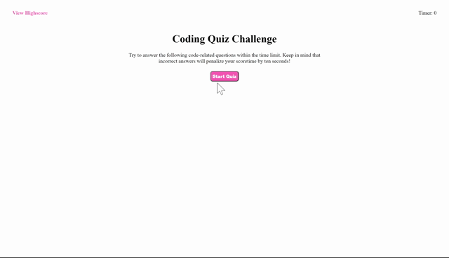

# Code-Quiz
## Purpose
Code-quiz app contains a bank of coding questions. It is a helpful source for coding students to reinforce and strengthen their coding knowledge. Each given question has four answer choices. One has a specific amount of time to finish the quiz depending on which question package one has chosen. Every wrong answer will result in a decrement of timer by 10 seconds. After finishing the quiz, one can save his results by typing his initials and retake the quiz as desire.
## Demo

## Tech
This code-quiz is built mainly with Javascript and jquery. 
## Deployed Website 
 https://sarah-nguyen1993.github.io/Code-Quiz/